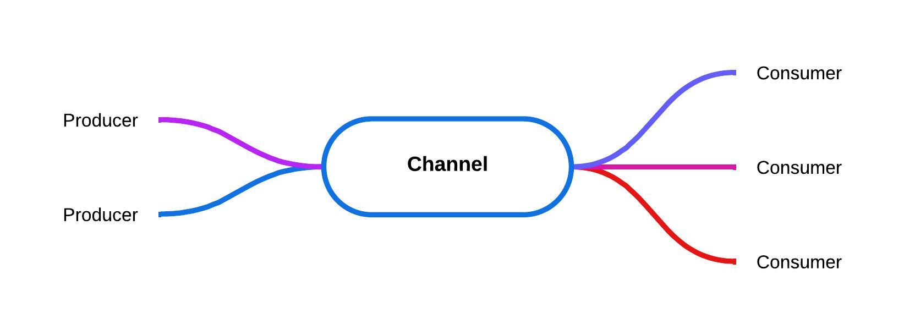
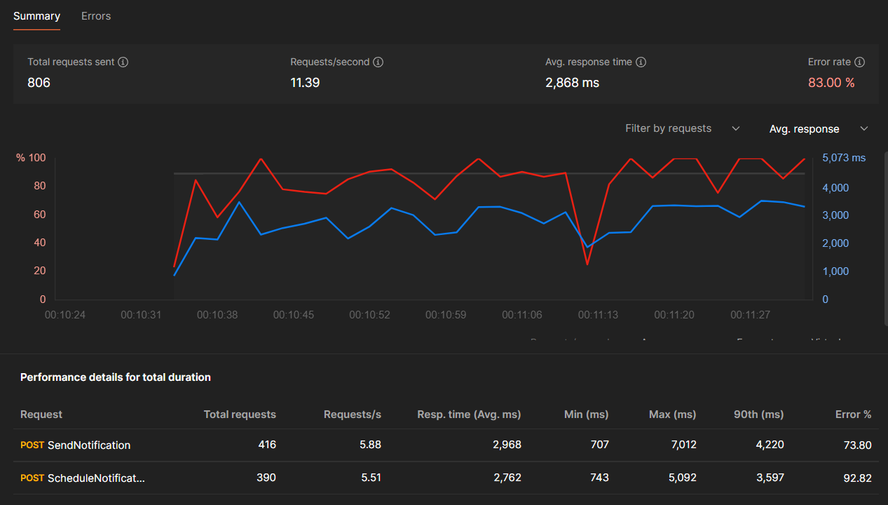
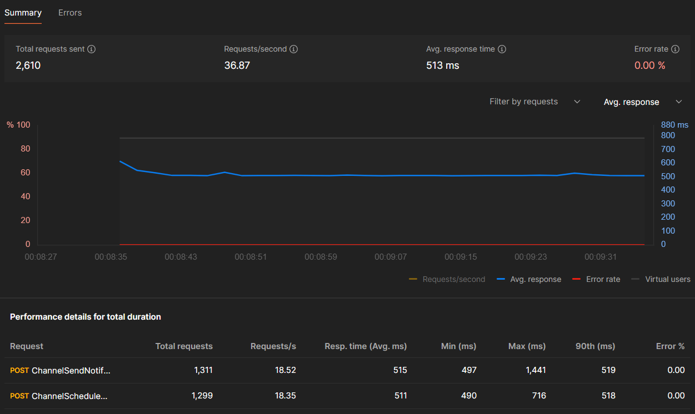
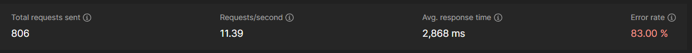
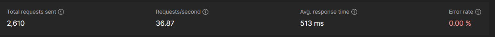

# Channel In Dotnet

A while back I was working on a project that a mutile endpoints in that project trying to access a file a read/write to that file. The project was working without any issue locally. The average response time was something around 2 seconds. Not good but not bad for running on my local machine and for what the service was doing. However when I did some performance testing via postman more issue started to raise! More than 80% of the requests fails due to I/O exception. Mutiple processes tries to have access to a single file and that was the issue. I some tricks like certalizing the reading/writing file service with locking to solve the issue but the average response time increased drastically to something ~4-5 seconds in performance testing on my local machine. 

After doing some research, I came a cross Channels that took my attention and it accured to me that it could solve the issue. I created Singleton Channel and added all the requests in the channel and let the Consumer read from the channel each request one by one. This gave the project some advantage that no request had to wait for the I/O operation to be finished, they are just added to the channel and later would be processed in the background by the BackgroundService.

## What is Channel?
Sure! So, imagine you're working on a project where different parts of your code need to talk to each other, but they're doing it asynchronously, meaning they're not waiting for each other to finish before moving on. That's where Channel<T> comes in handy!

Think of it like a virtual pipeline where one part of your code, let's call it the sender or producer, can drop stuff (like data) into the channel, and another part, let's call it the receiver or consumer, can pick it up when it's ready, without them getting tangled up or stepping on each other's toes.

Now, the cool thing is, you can have multiple producers and consumers working at the same time, which is great for speeding things up or organizing your workflow. Plus, you can set it up so if one part doesn't need the channel anymore, it can say, "Okay, I'm done," and clean up after itself.

And don't worry about things going haywire with all this multitasking because Channel<T> handles all the behind-the-scenes stuff to make sure everything runs smoothly and no one steps on anyone else's toes. It's like having a super organized party planner for your code!

Read more about Channels [Here at Microsoft](https://learn.microsoft.com/en-us/dotnet/core/extensions/channels) 

## Project in this Repo
In this project I tried to creat a real time example of events and some data writting in the file with 2 different approaches to show you how channels can improve performance.

In the NotificationController there are 4 endpoints. The first 2 endpoints (SendNotification and ScheduleNotification) are handling the requesting without using channel. Trying to access the file in each requests. The chance that mutile request will end up accssing the file will increase and most of the request will fail. Below is an example of the performance tests resutl.

As you can see in this test ~83% of the request fails with a average response time of ~3 seconds.

#### Code Improvement with Channels
In the NotificationController, we have two additional endpoints, namely channel/SendNotification and channel/ScheduleNotification, which utilize channels to manage incoming requests. These endpoints place each request into a channel, and then a background service picks them up and processes them one by one. This ensures that only one request at a time has access to the file, preventing conflicts. Since these requests are handled in the background, they don't need to wait for the I/O operation to finish. As a result, we've seen a tremendous improvement in response time

As you can see in this test the request success rate was 100% and response average time was 500 mls. Around 6 times faster compare to our first approach.  

Final resuls

First Approach

Channel Approach

