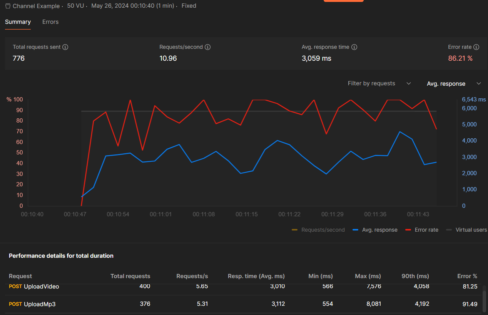
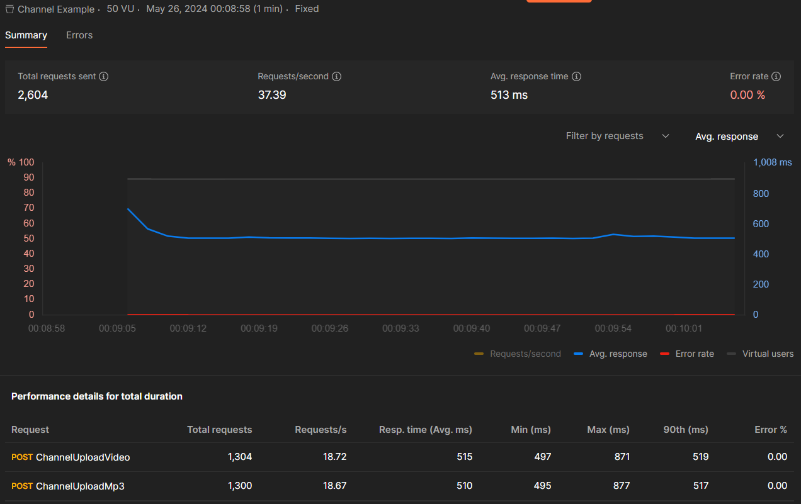

# Channel In Dotnet

A while back, I encountered an issue while working on a project where multiple endpoints were trying to access and read/write to a file. Locally, everything seemed fine, with an average response time of around 2 seconds, which was acceptable for my machine's performance and the service's tasks. However, during performance testing with Postman, things took a turn for the worse. Over 80% of the requests failed due to I/O exceptions. The root cause? Multiple processes vying for access to the same file.

I tried some tricks like centralizing the file service with locking to address the issue, but this caused the average response time to skyrocket to around 4-5 seconds during local performance testing.

After some research, I stumbled upon Channels, which piqued my interest. It struck me that Channels could be the solution. I implemented a Singleton Channel and queued all requests into it, allowing the Consumer to process each request one by one. This approach provided a significant advantage: requests no longer needed to wait for the I/O operation to finish. Instead, they were added to the channel and later processed in the background by the BackgroundService

## What is Channel?
Sure! So, imagine you're working on a project where different parts of your code need to talk to each other, but they're doing it asynchronously, meaning they're not waiting for each other to finish before moving on. That's where Channel<T> comes in handy!

Think of it like a virtual pipeline where one part of your code, let's call it the sender or producer, can drop stuff (like data) into the channel, and another part, let's call it the receiver or consumer, can pick it up when it's ready, without them getting tangled up or stepping on each other's toes.

Now, the cool thing is, you can have multiple producers and consumers working at the same time, which is great for speeding things up or organizing your workflow. Plus, you can set it up so if one part doesn't need the channel anymore, it can say, "Okay, I'm done," and clean up after itself.

And don't worry about things going haywire with all this multitasking because Channel<T> handles all the behind-the-scenes stuff to make sure everything runs smoothly and no one steps on anyone else's toes. It's like having a super organized party planner for your code!

Read more about Channels [Here at Microsoft](https://learn.microsoft.com/en-us/dotnet/core/extensions/channels) 

## Project in this Repo
In this project, I aimed to demonstrate real-time event handling with data writing to a file using two different approaches to showcase how channels can enhance performance.

Within the MediaController, we have four endpoints. The initial two (UploadVideo and UploadMp4) handle requests without utilizing channels, leading to repeated file accesses with each request. Consequently, the likelihood of multiple requests accessing the file simultaneously rises, resulting in numerous failures. Below, you'll find an example of the performance test results

As you can see in this test ~86% of the request fails with a average response time of ~3 seconds.

#### Code Improvement with Channels
In the MediaController, we have two additional endpoints, (channel/UploadVideo and channel/UploadMp4), which utilize channels to manage incoming requests. These endpoints place each request into a channel, and then a background service picks them up and processes them one by one. This ensures that only one request at a time has access to the file, preventing conflicts. Since these requests are handled in the background, they don't need to wait for the I/O operation to finish. As a result, we've seen a tremendous improvement in response time

As you can see in this test the request success rate was 100% and response average time was 500 mls. Around 6 times faster compare to our first approach.  

Final resuls

First Approach

Channel Approach
